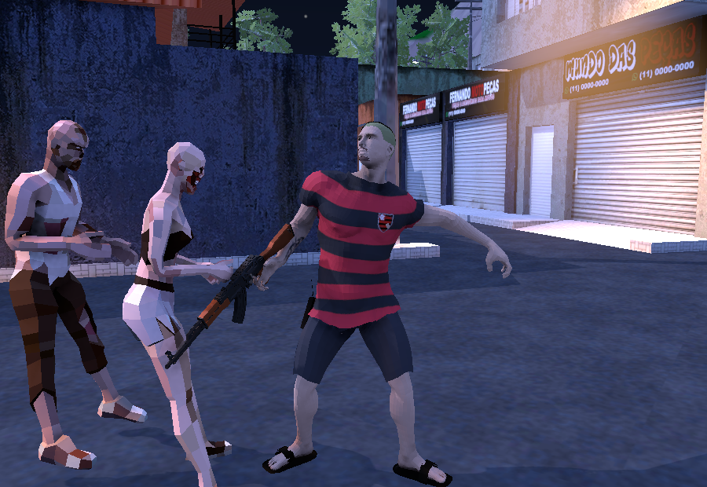
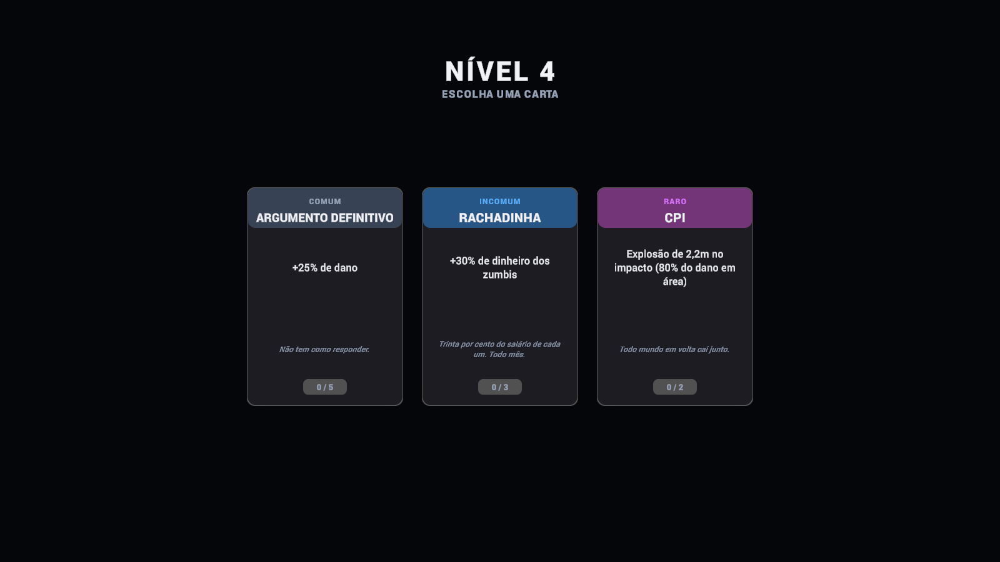
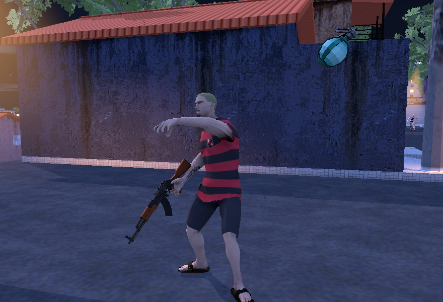
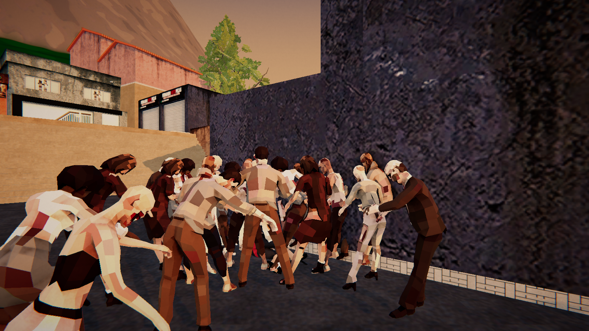
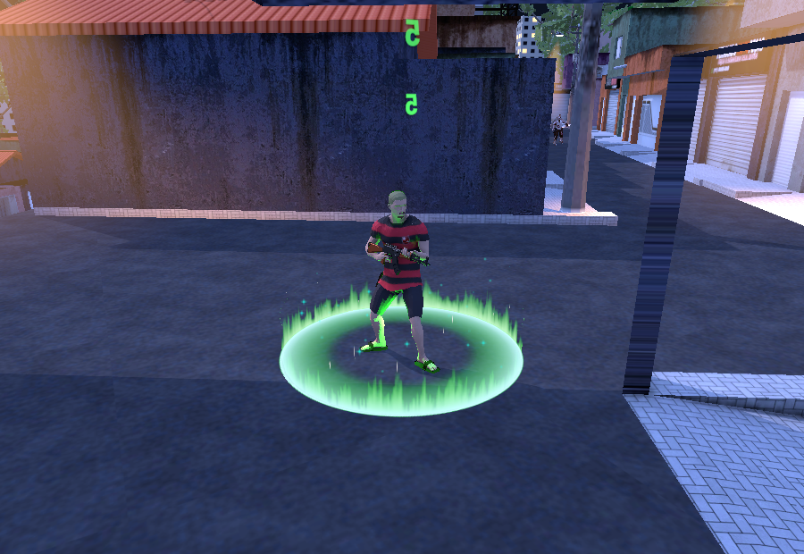

# Impróprio Para Consumo

Shooter de horda em terceira pessoa, feito em **Unity 6 / URP**, ambientado numa favela carioca à noite.
Você segura ondas de zumbis que ficam progressivamente mais difíceis, junta dinheiro e XP, escolhe cartas de upgrade entre as ondas e melhora a arma numa armaria entre partidas.

Este repositório contém **o código-fonte do jogo** — os 86 scripts que eu escrevi. O projeto Unity completo é privado porque inclui pacotes de arte comprados, que não podem ser redistribuídos.



---

## O que é meu e o que não é

Sendo direto, porque é a primeira pergunta que se faz num projeto assim:

**Meu — tudo neste repositório:**
todos os sistemas de jogo, a arquitetura, a UI, a progressão, a IA, a física de morte, o gerador procedural da cidade. 86 scripts, 17.911 linhas.

**Não é meu:**
modelos, animações e efeitos visuais são pacotes comprados na Asset Store e no Mixamo — Voyager (animações), Hovl Studio (VFX), PolyOne, TreePack, e o modelo da AK-47. Nada de arte neste projeto foi feito por mim.

---

## Os sistemas de que eu mais me orgulho

### Diretor de dificuldade por orçamento de crédito

Não é "spawna mais rápido com o tempo". É o modelo do **Risk of Rain 2**: um coeficiente cresce com o tempo e com as ondas concluídas, esse coeficiente vira crédito por segundo, e o diretor *compra* zumbis de um catálogo onde cada tipo tem custo, peso e nível mínimo de aparição.

```
coeff = (fatorJogador + minutos × 0,1012) × 1,015 ^ ondasConcluídas
nível = 1 + (coeff − 1) / 0,33
```

O efeito é que a composição da horda muda sozinha ao longo da partida — no começo só o zumbi básico de custo 10; mais tarde o diretor tem crédito pra comprar um Blindado de custo 70, ou gastar tudo em Enxame de custo 6. Adicionar um novo tipo de inimigo é criar um ScriptableObject, sem tocar em uma linha do diretor.

`Scripts/Systems/Dificuldade.cs` · `Scripts/Systems/WaveManager.cs` · `Scripts/Systems/TipoZumbi.cs`

### Ragdoll construído em código a partir do esqueleto

Nenhum zumbi tem ragdoll configurado à mão. Na inicialização, o script lê os ossos do Avatar humanoide e monta sozinho os colisores, rigidbodies, juntas e hitboxes — cápsula de membro alinhada do osso até o osso filho, caixa no tronco, esfera na cabeça — com multiplicador de dano por região (cabeça 2×, membro 0,7×).

Em vida os corpos ficam cinemáticos e servem só de hitbox. Na morte a física assume e o osso atingido leva um impulso na direção do tiro, então a "animação de morte" emerge da física: tiro no ombro esquerdo joga o ombro esquerdo pra trás.

Um script serve pros dez zumbis do pacote.

`Scripts/Enemies/ZombieRagdoll.cs`

### 42 cartas de upgrade sem acoplamento

As cartas mexem em dano, cadência, granada, defesa, vida, movimento e efeitos como corrente elétrica, aura de fogo, espinhos e vampirismo. Nenhuma delas precisou de um `if` espalhado pelo código:

- **Abates** chegam por um evento estático central, `Health.QualquerMorte` — um só gancho cobre tiro, explosão, fogo, ácido e granada
- **Defesa** entra por `Health.FiltroDano`, um `Func<int,int>` que roda antes do desconto de vida. Foi assim que "Segunda Chance" (intercepta o golpe letal e revive) e "Placa de Cerâmica" (reduz dano) entraram sem tocar em nenhum caminho de dano existente

`Scripts/Core/Health.cs` · `Scripts/Player/EfeitosJogador.cs` · `Scripts/Progression/UpgradeInventory.cs`



### Arremesso de granada casado com a animação

A granada não nasce no aperto da tecla — ela nasce **da mão do personagem, no quadro em que o braço solta**, como CoD e Gears fazem.

Pra acertar o quadro, medi a mão esquerda quadro a quadro dentro do próprio arquivo de animação: o pico de velocidade pra frente é 4,56 m/s em t=1,90 s (a mão direita, que segura o fuzil, faz só 1,60 m/s — foi assim que descobri que o clipe é canhoto). Como a preparação do clipe é longa demais pra jogo de horda, ele entra já em t=1,22 s e roda a 1,55×, o que dá **0,44 s até soltar** — a mesma janela dos shooters de referência.

Roda numa camada própria do Animator, com máscara só de braços, então as pernas continuam correndo durante o arremesso.

`Scripts/Jogador/AnimacaoJogador.cs` · `Scripts/Weapons/LancadorGranadas.cs`



### Três armas que ocupam espaços diferentes

O problema de colocar uma segunda arma num jogo de horda é que uma delas sempre vira a certa. A escopeta não foi ajustada no olho: eu montei uma bancada dentro do editor — alvos congelados a distâncias fixas, recuo zerado, 40 a 60 tiros por ponto — e medi o dano médio por tiro das duas, de quadril e mirando, contra um alvo só e contra uma fila de quatro.

O resultado é o cruzamento que eu queria:

| mirando, DPS sustentado | 3 m | 6 m | 10 m | 16 m | 25 m |
|---|---|---|---|---|---|
| **alvo só** — Calibre 12 | 193 | 186 | 153 | 67 | 22 |
| **alvo só** — AK-47 | 189 | 199 | 186 | 166 | 100 |
| **fila de 4** — Calibre 12 | 407 | 385 | 278 | 141 | 51 |
| **fila de 4** — AK-47 | 203 | 203 | 183 | 161 | 116 |

Contra um alvo só elas empatam até uns 6 m e depois a AK abre. Contra um aglomerado a 12 vale o dobro até 10 m, e perde a partir dos 16 m. Nenhuma das duas é melhor: elas resolvem problemas diferentes.

O que produz essa curva são três mecanismos, todos emprestados de jogos que já resolveram isso — Left 4 Dead 2, Call of Duty e Killing Floor:

- **espalhamento em cone**, que faz o chumbo abrir com a distância (a 3 m o tiro inteiro cabe no alvo; a 18 m cabem 17% dele)
- **queda de dano por distância** na ficha da arma, um degrau suave entre 12 m e 30 m
- **perfuração**, que faz cada bago atravessar até dois zumbis — é o que transforma uma fila numa oportunidade em vez de um problema

O lança-rojão é o terceiro caminho: projétil de verdade, que voa e pode ser desviado, com estouro em área e dano no próprio jogador se ele atirar perto demais. Um foguete a cada seis segundos.

`Scripts/Weapons/WeaponData.cs` · `Scripts/Weapons/WeaponController.cs` · `Scripts/Weapons/Foguete.cs`

### Cidade gerada por código

A favela, o morro, a orla e o panorama do Rio ao fundo são gerados proceduralmente na carga da cena — ruas, lajes, muros, vegetação, iluminação de poste e céu de fim de tarde. Cerca de 1.800 linhas entre os geradores.

`Scripts/World/`



### Cura gradual com crédito

O kit de primeiros socorros não enche a barra num piscar: ele abre um crédito de 30% da vida máxima que escorre ao longo de 3 segundos, com um círculo de cura aceso em volta do jogador enquanto dura. Pegar um segundo kit no meio soma ao crédito restante e acelera a entrega, em vez de virar fila.

`Scripts/Player/CuraGradual.cs`



---

## Mapa do código

```
Scripts/
├── Core/          Vida, dano, eventos centrais de morte
├── Enemies/       IA de perseguição por NavMesh, ragdoll, hitboxes
├── Jogador/       Animação, câmera, agachar, pulo, entrada
├── Player/        Efeitos das cartas, vitais, HUD de vida
├── Progression/   XP, nível, drops, inventário de upgrades
├── Systems/       Diretor de ondas, dificuldade, estatísticas da run
├── UI/            Menu, armaria, pausa, fim de jogo, roleta de cartas
├── Weapons/       Arma, anexos, recuo, granadas, cápsulas
├── World/         Geradores procedurais da cidade
└── FX/            Números de dano, catálogo de VFX
```

---

## Estado do projeto

Em desenvolvimento. Funciona de ponta a ponta — menu, partida, progressão, morte, meta-progressão entre partidas — mas ainda faltam coisas que eu sei que faltam:

- **áudio** (o jogo ainda não tem nenhum som)
- um objetivo de fim de partida (chefe, extração, algo que encerre a run)
- inimigos que exijam respostas diferentes, não só mais vida

O projeto começou em junho de 2026 e passou a ser versionado em agosto, então o histórico deste repositório não cobre o início.

---

## Números

| | |
|---|---|
| Scripts | 86 |
| Linhas | 17.911 |
| Cartas de upgrade | 42 |
| Tipos de zumbi | 5 |
| Armas | 3 |
| Anexos de arma | 58 |
| Engine | Unity 6 · URP Deferred |

---

**Pietro Piccoli** · [github.com/Pietro-Piccoli](https://github.com/Pietro-Piccoli)
